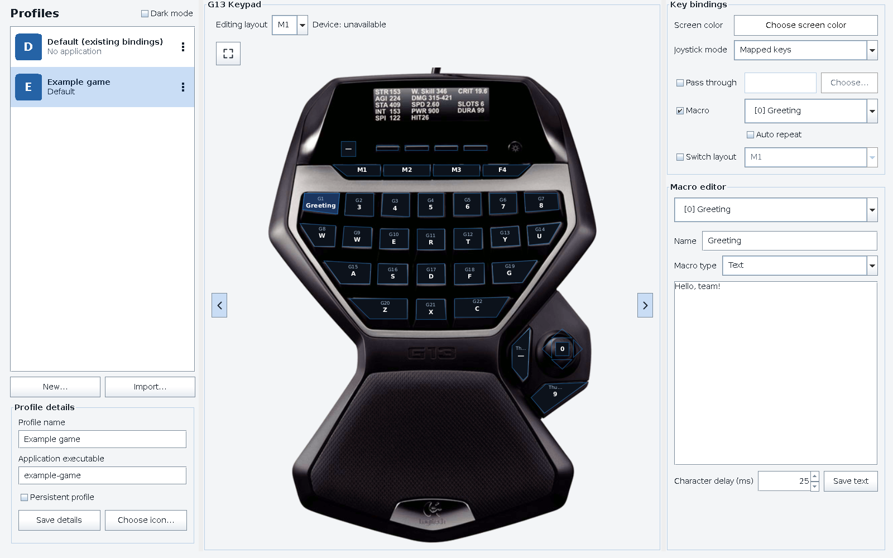

# G13 Linux Driver & GUI (Modernized Fork)

This is a modernized fork of the G13 driver for Linux.
The original project is over 10 years old. This fork has been refactored to use modern C++ standards for the driver and modern Java standards (Java 17 with Maven) for the configuration GUI.

For a short code and behavior overview, see [How the G13 app works](docs/architecture.md). Development instructions are in [AGENTS.md](AGENTS.md).

## Features

* **Modern C++ Driver:** The core driver has been updated for better performance and compatibility.
* **Java GUI:** The configuration utility is built with Java 17 and Maven, ensuring it runs on modern systems.
* **Flexible Configuration:** Offers multiple ways to configure your G13: via the user-friendly GUI, manual file editing, or using the driver's fixed mapping with external tools.

## Requirements

### Base Requirements

You need to install the following packages via your package manager:

* `make`
* `cmake`
* `gtk3` / `gtk3-devel`
* `libusb-1.0-0` (on some distros named `libusb-1.0-0-dev` or `libusb1-devel`)
* `libappindicator-gtk3` (or similar)
* `Java 17` or higher and `maven`
* Optional: `python-psutil` (only for the existing LCD monitor example)

### Automated Dependency Installation

Alternatively, all needed dependencies can be installed via the `install_deps.sh` script located in the scripts folder.

```bash
make dependencies
```

## Fedora preview installation

Install or upgrade a prebuilt preview with the [copy/paste instructions](docs/previews.md). Initially supports DNF-managed Fedora 44 x86_64. The installer checks dependencies, verifies the archive, deploys a managed release, and restarts the user service while preserving configuration. Private repository downloads require GitHub authentication.

## Build & Installation

Build a versioned release locally, then deploy that release:

```bash
make dependencies    # Optional: install build dependencies (uses sudo)
make all             # Build and package into dist/; no installation
make test            # Isolated deployment tests
make install-user    # Install the built release for this user
# OR: sudo make install  # Install it system-wide
```

To enable or restart the user service as part of user deployment, use
`make install-user DEPLOY_FLAGS=--activate`.

An extracted release works without the source checkout: run
`bash install.sh install --scope user --activate` from its directory.
The installer preserves the previous release for rollback and leaves user bindings
and macros intact. System-wide installation registers a user service; each desktop
user enables/restarts it separately.

See [Release deployment](docs/releases.md) for installed paths, platform requirements,
one-time device permissions, legacy migration, updates, rollback, and staged installs.

## How to use the Driver and GUI

### Run the driver

### Controlling the Driver
The driver runs in the background via Systemd.

Check Status:

```bash
systemctl --user status g13
```

View Logs:

```bash
journalctl --user -u g13 -f
```

Restart Driver:

```bash
systemctl --user restart g13
```


### Use the Config Tool

After starting the driver, you will see a new icon in your system tray/taskbar. This allows you to open the config menu or quit the driver.

Alternatively, run it from the terminal:

```bash
g13-gui
```

This will bring up the UI.

Profiles: The top 4 buttons under the LCD (M1, M2, M3, MR) switch between binding profiles.

Save: Changes are saved automatically to `~/.config/g13/bindings-*.properties`.

Live Reload: The driver automatically detects file changes and reloads the config immediately.



The top 4 buttons under the LCD screen select the bindings (M1-M3, MR).

> **Note:** The driver watches the active binding file, but macro-only changes and some rapid edits may require switching banks or restarting. See [the architecture guide](docs/architecture.md) for the current reload limitations.

### Use the built-in Mapping Set (for external tools)

The driver now includes a fixed default mapping. This means the GUI is not strictly necessary if you prefer other tools. You can map the keys using software like **Input Remapper**.

The physical M1–MR buttons select the driver bank. Clicking them in the GUI chooses the bank to edit.

### Manually create your own Mapping Set

If you don't want to use the GUI App, you can edit the files manually in `~/.config/g13/`.

* **Usage Example:** To map the **G20** key to the letter **T**, find the event code for T (which is 20). Then, in your `bindings-0.properties` file, add or edit the line:
    ```ini
    G20=p,k.20
    ```

### Using the Display (scripting)

You can write text to the display using a simple pipe command:

The driver creates a Named Pipe (FIFO) to receive text for the LCD.

Location: `/run/user/$UID/g13-lcd` (Check `/tmp/g13-lcd` as fallback if `/run` is unavailable).

```bash
# Find your pipe path (usually based on your user ID, e.g., 1000)
PIPE="/run/user/$(id -u)/g13-lcd"

# Send simple text
echo "Hello World!" > $PIPE

# Send multi-line text (CPU/RAM stats)
echo -e "CPU: 50%\nRAM: 4GB" > $PIPE
```

Currently, only one font size is implemented. There is an example script for system monitoring in the `scripts` folder. Feel free to try it out, modify it, or share your own scripts!


### Release status and rollback

```bash
g13-release status --scope user
g13-release rollback --scope user --activate
```

See [Release deployment](docs/releases.md) for the system-wide equivalents.

## Notes

* Tested on 64-bit Arch Linux.

### Windows profile import

The GUI can import one Logitech Gaming Software XML export at a time into a separate named profile. Select **Import Windows profile…**, review the conversion warnings, then choose **Use profile** to activate it. Existing configuration remains available as **Default (existing bindings)**. See [the import guide](docs/profile-import.md) for supported mappings, testing, and limitations.
