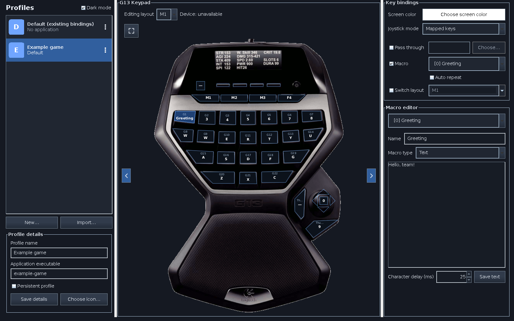
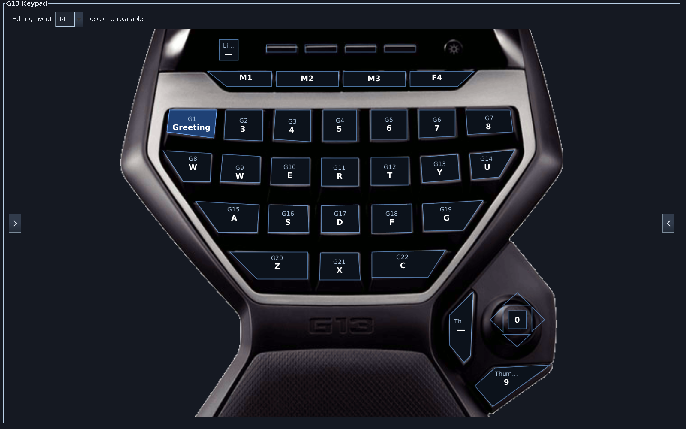

# G13 Linux Driver & GUI (Modernized Fork)

This is a modernized fork of the G13 driver for Linux.

Forked from [Lordbooker/linux-g13-driver](https://github.com/Lordbooker/linux-g13-driver). Thanks to the original maintainer for building the foundation.

The original project is over 10 years old. This fork has been refactored to use modern C++ standards for the driver and modern Java standards (Java 17 with Maven) for the configuration GUI.

For a short code and behavior overview, see [How the G13 app works](docs/architecture.md). Development instructions are in [AGENTS.md](AGENTS.md).

## Features

* **C++17 driver:** Keyboard, mouse-button, media/system-key, and analog joystick output, with RGB backlighting and a scriptable LCD.
* **Java 17 GUI:** Named profiles, three editable layouts, recorded and text macros, light/dark appearance, and a resizable keypad preview with live physical-input highlighting.
* **Profile selection:** Match running Linux applications, choose a default fallback, or pin a persistent profile. Import individual Logitech Gaming Software XML profiles.

## Requirements

### Base Requirements

You need to install the following packages via your package manager:

* A C++17 compiler, `make`, `cmake`, and `pkg-config`
* GTK3, libusb-1.0, and AppIndicator3 development packages (names vary by distribution)
* A Java 17+ JDK with desktop/AWT support and `maven`
* `curl` and `jq` for the preview installer and its tests
* Optional: `python-psutil` (only for the existing LCD monitor example)

### Automated Dependency Installation

Install build dependencies using the helper at `g13-driver/src/scripts/install_deps.sh`, invoked from the repository root:

```bash
make dependencies
```

## Fedora preview installation

Install or upgrade a prebuilt preview with the [copy/paste instructions](docs/previews.md). The downloader supports DNF-managed Fedora 44 x86_64. It checks dependencies, verifies the archive, deploys a managed release, and restarts the user service while preserving configuration. This repository is public; authentication is optional for public downloads.

## Build & Installation

Build a versioned release locally, then deploy that release:

```bash
make dependencies    # Optional: install build dependencies (uses sudo)
make all             # Build and package into dist/; no installation
make test            # Deployment, downloader, Java GUI/import, and native action tests
make install-user    # Install the built release for this user
# OR: sudo make install  # Install it system-wide
```

For quick testing of the current checkout on a system-wide managed installation,
run `./local-make.sh` as your desktop user. It builds the driver and Java GUI,
installs the local release through `sudo`, refreshes device access, and restarts
the user service. Close and reopen the configuration window afterward. Per-event
input logging is disabled by default; use `./local-make.sh --debug-input` when a
trace is needed.

To enable or restart the user service as part of user deployment, use
`make install-user DEPLOY_FLAGS=--activate`.

An extracted release works without the source checkout: run
`bash install.sh install --scope user --activate` from its directory.
The installer preserves the previous release for rollback and leaves user bindings
and macros intact. System-wide installation registers a user service; each desktop
user enables/restarts it separately.

See [Release deployment](docs/releases.md) for installed paths, platform requirements,
one-time device permissions, legacy migration, updates, rollback, and staged installs.

## How to use the Driver and GUI

### Controlling the Driver
The driver runs in the background via Systemd.

Check Status:

```bash
systemctl --user status g13
```

View Logs:

```bash
journalctl --user -u g13 -f
```

Restart Driver:

```bash
systemctl --user restart g13
```


### Use the Config Tool

After starting the driver, you will see a new icon in your system tray/taskbar. This allows you to open the config menu or quit the driver.

Alternatively, run it from the terminal:

```bash
g13-gui
```

The GUI can also edit configuration while the driver is stopped.


Profiles: Select a row to edit that profile. **New…** and **Import…** are below the list; the row's three-dot menu offers **Set Default**, **Set Persistent**, and deletion. **Persistent profile** is also available in profile details. Save name and executable changes with **Save details**. Running-process matching is not foreground-window detection; selecting a row alone does not activate that profile on the device.

Button layouts: Use **Editing layout** to edit M1–M3. Any control can switch layouts, including the physical M buttons, which can also be remapped as ordinary inputs. Physical layout changes update the preview even while another application has focus. Held controls briefly highlight yellow. **Device** reports the driver's last published layout and whether it belongs to the editing profile; it is not a service-health or activation acknowledgement.

Bindings: Click a keypad control, then choose Pass through, Macro, or Switch layout. **Choose…** includes keyboard, mouse-button, media, and system inputs. **Joystick mode** selects mapped direction keys or analog axes for the layout. Imported modifier chords are displayed but do not yet have an editor.

Saving: Binding, color, and joystick changes save automatically. Press Enter to save a macro name; use **Save text** for text-macro content and delay. Configuration lives in `$XDG_CONFIG_HOME/g13` (normally `~/.config/g13`); named profiles have their own `profiles/<UUID>/` directories.

Reloading: The driver watches the active layout's binding file. Macro-only edits do not trigger a reload: switch to another layout and back, change active profiles, or restart the service. See [the architecture guide](docs/architecture.md).

Appearance: Use **Dark mode** in the profiles sidebar. Drag dividers to resize sidebars, use edge chevrons to hide/show them, or choose the expand icon for theatre view. Double-click the preview to reopen the editor.





These images use synthetic sample configuration. [Regenerate the screenshots](docs/screenshots/README.md) from current sources without accessing your device or settings.

### Use the built-in Mapping Set (for external tools)

The driver creates default binding files when they are missing. You can edit these directly or remap the virtual inputs with external tools; the GUI is optional. Driver-created and GUI-created legacy defaults differ, so inspect your actual files before relying on a particular mapping.

Binding files can assign `b,0`, `b,1`, or `b,2` to any control to switch layouts. Physical M1–M3 use these actions by default. Selecting a layout in the GUI only chooses the layout being edited.

### Manually create your own Mapping Set

If you don't want to use the GUI App, you can edit the files manually in `~/.config/g13/`.

* **Usage Example:** To map the printed **G20** key to **T** (Linux keycode 20), edit `bindings-0.properties` in the relevant profile directory:
    ```ini
    G19=p,k.20
    ```

Internal G-key indices are zero-based: printed G1 is `G0`, and printed G20 is `G19`. See [keycodes and button labels](docs/keycodes.md) for more mappings. [Configuration formats](docs/architecture.md#named-profiles-and-configuration) cover layout switches, chords, macros, and analog mode.

### Using the Display (scripting)

You can write text to the display using a simple pipe command:

The driver creates a Named Pipe (FIFO) to receive text for the LCD.

Location: `$XDG_RUNTIME_DIR/g13-lcd` (normally `/run/user/$UID/g13-lcd`), or `/tmp/g13-lcd` when `XDG_RUNTIME_DIR` is unset.

```bash
# Run while the driver is connected and reading the pipe.
PIPE="${XDG_RUNTIME_DIR:-/tmp}/g13-lcd"

# Send simple text
printf 'Hello World!\n' > "$PIPE"

# Send multi-line text (CPU/RAM stats)
printf 'CPU: 50%%\nRAM: 4GB\n' > "$PIPE"
```

Only one font size is implemented. The optional monitor example is `g13-driver/src/scripts/g13_monitor.py` and requires Python with psutil. Writing to a FIFO waits until a reader is available.


### Release status and rollback

```bash
g13-release status --scope user
g13-release rollback --scope user --activate
```

See [Release deployment](docs/releases.md) for the system-wide equivalents.

## Notes

* The preview pipeline targets Fedora 44 x86_64. Broader install/upgrade validation remains open for [Debian/Ubuntu](https://github.com/scott-wi/linux-g13-driver/issues/3), [Arch](https://github.com/scott-wi/linux-g13-driver/issues/4), and [openSUSE](https://github.com/scott-wi/linux-g13-driver/issues/5). Automated tests use mocked hardware.

### Windows profile import

Import one Logitech Gaming Software XML export at a time into a separate named profile. Supported assignments include keys, held modifier chords, balanced key macros, US-keyboard text blocks, M1–M3 layout switches, and analog joystick actions. Existing root-level configuration remains available as **Default (existing bindings)**.

Folder import, Logitech mouse-action conversion, toggle repeat, a chord editor, and Lua execution remain unimplemented. See [the import guide](docs/profile-import.md) for exact support and [the issue audit](docs/issue-audit.md) for remaining work.
